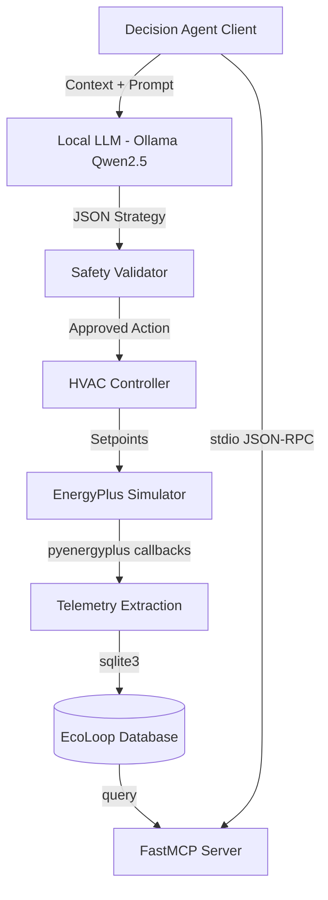

# EcoLoop AI - Architecture Overview

## The Challenge
To build an AI-powered autonomous Building Management System (BMS) that integrates EnergyPlus with an open-source LLM (Qwen2.5) via the Model Context Protocol (MCP), optimizing energy consumption, comfort, and carbon goals.

## System Architecture

EcoLoop relies on a closed-loop system design consisting of the following key components:

### 1. Building Simulator (EnergyPlus)
- **Role**: Simulates building physics, thermal dynamics, and occupancy in real time.
- **Technology**: `pyenergyplus.api` (EnergyPlus Python API).
- **Process**: The system accepts `.epw` (Weather) and `.idf` (Building Model) files, advancing the simulation continuously. At each zone timestep, an API callback intercepts the state, freezing it for analysis.

### 2. Telemetry & Context Engine
- **Role**: Extracts simulation data (Energy, Indoor Temp, Carbon Emissions, Occupancy, Comfort) and stores it synchronously.
- **Technology**: SQLite database for telemetry persistence and historical analytics.

### 3. Model Context Protocol (MCP) Server
- **Role**: Provides a standard, tool-driven interface for LLMs to query the building's context.
- **Technology**: Official Python `mcp` SDK (`FastMCP`).
- **Process**: The server exposes a `get_building_telemetry` tool. When called via standard I/O JSON-RPC, it formats the latest building state and carbon footprint into a structured MCP context payload.

### 4. Autonomous Decision Agent
- **Role**: Acts as the AI brain, reasoning over the MCP context against predefined goals (Energy Savings, Comfort, Carbon Reduction).
- **Technology**: `decision_agent.py` acting as an MCP Client over stdio.
- **Process**: The agent fetches data from the MCP Server and constructs a prompt for the local Qwen2.5 LLM running via Ollama. The LLM analyzes the data and responds with a JSON-formatted HVAC strategy.

### 5. Control & Safety Layer
- **Role**: Actuates physical changes to the HVAC system safely.
- **Technology**: Rule-based validators (`safety/validator.py`) and standard controllers (`controller/hvac_controller.py`).
- **Process**: The LLM's suggested action is verified against hard safety constraints (e.g., maximum temperature deviations) before being sent back into the EnergyPlus simulator to affect the next timestep, closing the loop.

## Data Flow Diagram

