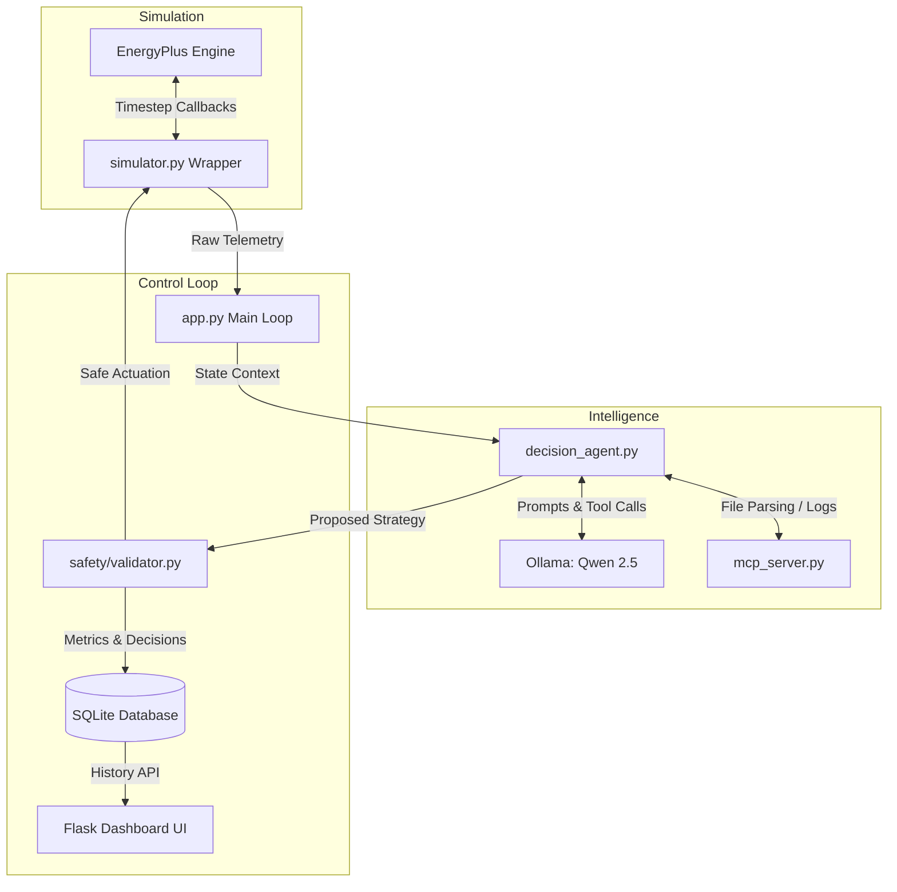

# Eco-Loop AI

Eco-Loop AI is an autonomous, physical AI proof-of-concept that dynamically manages building operations to optimize energy consumption while maintaining occupant comfort.

By integrating the high-fidelity **EnergyPlus** simulation engine with an **Open-Source LLM** (Qwen 2.5 via Ollama) and a **Model Context Protocol (MCP)** tool-calling framework, Eco-Loop creates a self-correcting, closed-loop pipeline for building management.

---

## Hackathon Objectives Met
- **Closed-Loop Execution:** Streams live performance metrics (temperatures, IAQ, PMV) from EnergyPlus to the LLM, evaluating them against dynamic targets, and executing safe HVAC setpoint overrides automatically.
- **Cognitive Agent & MCP Integration:** Utilizes local LLMs capable of tool-calling to extract simulation metadata and dynamically adjust parameters without human code modification.
- **Quantitative Savings Dashboard:** Features a responsive, modern UI comparing baseline energy consumption against AI-optimized strategies, calculating net-reductions in kWh.
- **Safety & Fallback Mechanisms:** A validation layer ensuring the LLM's decisions maintain thermal comfort and never breach hard safety constraints.

## System Architecture




- 

## 🚀 Getting Started

### Prerequisites
1. **Python 3.10+**
2. **EnergyPlus:** Ensure EnergyPlus is installed locally. 
   *(Note: Update the `ep_path` in `energyplus/simulator.py` to match your installation path, e.g., `C:\EnergyPlusV24-1-0`)*
3. **Ollama:** Install Ollama and pull the required model:
   ```bash
   ollama pull qwen2.5:1.5b
   ```

### Installation
1. Clone the repository:
   ```bash
   git clone https://github.com/pritamrangari27/Eco-loop.git
   cd Eco-loop/eco-loop-ai
   ```
2. Install the required dependencies:
   ```bash
   pip install -r requirements.txt
   ```

### Running the System
Start the main application and dashboard loop:
```bash
python app.py
```
Open your browser and navigate to `http://localhost:5000` to view the live optimization dashboard.

---

## 📁 Repository Structure
```text
eco-loop-ai/
├── agents/             # LLM orchestrator & tool execution
├── config/             # System constants and model definitions
├── controller/         # HVAC actuation translation
├── dashboard/          # Frontend templates (HTML/JS/CSS)
├── database/           # SQLite logging & telemetry storage
├── energyplus/         # Simulation wrapper & physics engine
├── monitoring/         # Telemetry aggregation
├── prompts/            # Core system prompt instructions
├── safety/             # Comfort & safety fallback logic
├── app.py              # Flask server and autonomous main loop
└── mcp_server.py       # Model Context Protocol tools for the LLM
```

## 📜 Deliverables Included
- **Source Code:** Unified python architecture.
- **Modified IDF:** Base building files and agent-modified outputs (`AI_Optimized_Runtime.idf`).
- **Architecture Doc:** See `ARCHITECTURE.md` for deep technical insight into prompt engineering and latency management.
- **Dashboard:** Built-in quantitative comparison and export functions.

---
*Built for the Autonomous Smart Buildings Hackathon.*


<!--  -->


